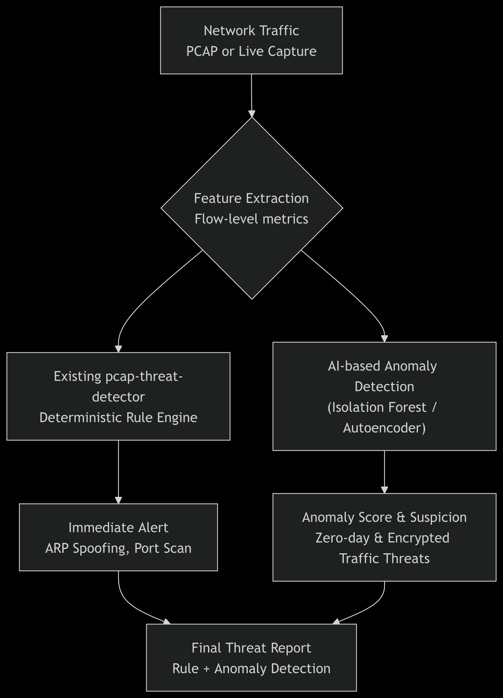

# pcap-threat-detector 🛡️

[](https://www.python.org/downloads/release/python-3110/)
[](https://opensource.org/licenses/MIT)
[](https://scapy.net/)
[](https://scikit-learn.org/)
[](https://GitHub.com/Adrian-Obungu/pcap-threat-detector/graphs/commit-activity)

> **A Hybrid AI-Driven Intrusion Detection System (IDS) for PCAP analysis, blending deterministic rules with unsupervised machine learning.**

---

## 🚀 Overview

**pcap-threat-detector** is a lightweight yet powerful network analysis tool designed to bridge the gap between traditional signature-based detection and modern behavioral anomaly detection. Built entirely in a cloud-native environment (GitHub Codespaces on an iPad), it leverages **Scapy** for high-fidelity packet parsing and **scikit-learn** for predictive anomaly scoring.

### 🧠 The Hybrid Approach
Traditional IDS tools often fail against zero-day exploits or encrypted traffic patterns. This project implements a dual-engine architecture:
1.  **Deterministic Rule Engine:** High-confidence detection for known attack patterns (ARP spoofing, port scans, DNS tunneling).
2.  **AI Anomaly Engine:** An **Isolation Forest** model that analyzes flow-level metadata (packet timing, sizes, and frequencies) to flag deviations from "normal" network behavior.

---

## ✨ Key Features

| Feature | Detection Method | Description |
| :--- | :--- | :--- |
| **ARP Spoofing** | Deterministic | Tracks MAC-IP bindings with time-based aging and flapping thresholds. [1] |
| **Port Scanning** | $O(n)$ Sliding Window | Detects rapid SYN scans per destination with configurable thresholds. [2] |
| **DNS Tunneling** | Entropy & Frequency | Analyzes subdomain length, Shannon entropy, and query frequency. [3] |
| **Data Exfiltration** | Flow-based Tracking | Monitors cumulative flow bytes and payload sizes for outbound traffic. [4] |
| **Zero-Day Detection** | Isolation Forest (AI) | Generates "AI Suspicion Scores" for flows that mathematically deviate from normal. [5] |

---

## 🛠️ Architecture



The system follows a hybrid processing pipeline where raw packet captures are first aggregated into flows before being analyzed by parallel detection engines. This ensures that we maintain high-confidence rule-based alerts while gaining behavioral insights from machine learning.


---

## 📦 Installation

### Prerequisites
- Python 3.11+
- [libpcap](https://www.tcpdump.org/) (for Scapy)

### Setup
```bash
# Clone the repository
git clone https://github.com/Adrian-Obungu/pcap-threat-detector.git
cd pcap-threat-detector

# Create and activate a virtual environment
python -m venv venv
source venv/bin/activate  # On Windows: venv\Scripts\activate

# Install dependencies
pip install -r requirements.txt
```

---

## 🚦 Usage

### 1. Training the AI Model
Before using the AI features, train the model on benign traffic data:
```bash
python src/ai/train_ai_model.py
```

### 2. Running the Hybrid Detector
Analyze a PCAP file using both rules and AI:
```bash
python src/detector/ai_runner.py test_pcaps/exfil.pcap --ai
```

### 3. Example Output
```text
[+] Total alerts: 2
[!] Data Exfiltration: Large ICMP packet (1400 bytes) from 192.168.1.100 to 8.8.8.8
[!] AI Anomaly: Flow 192.168.1.100 -> 8.8.8.8 (other) | Score: -0.1475 | Status: ANOMALY
```

---

## 📂 Project Structure

```text
.
├── src/
│   ├── detector/      # Core detection engines (Rules + AI Runner)
│   └── ai/            # Model training and ML logic
├── scripts/           # Synthetic traffic generation utilities
├── data/              # Whitelists and internal subnet configs
├── models/            # Serialized ML models (.pkl)
├── test_pcaps/        # Sample captures for validation
└── docs/              # Extended documentation and research
```

---

## 🛡️ Security & Ethics
This tool is for **educational and defensive security research purposes only**. It was developed to help security professionals understand the shift from signature-based to behavioral-based detection. Always ensure you have explicit permission before monitoring network traffic.

---

## 🤝 Contributing
Contributions are what make the open-source community such an amazing place! See [CONTRIBUTING.md](CONTRIBUTING.md) for details.

---

## 📄 License
Distributed under the MIT License. See [LICENSE](LICENSE) for more information.

---

## 🔗 Connect with the Developer
**Adrian S. Obungu**
- [LinkedIn](https://www.linkedin.com/in/adrian-o-9b4856260)
- [GitHub](https://github.com/Adrian-Obungu)
- [Project Portfolio](https://github.com/Adrian-Obungu/pcap-threat-detector)

---
*Developed on an iPad Pro via GitHub Codespaces.*

---

## 📚 References
1. [Scapy Documentation](https://scapy.readthedocs.io/)
2. [Liu, F. T., Ting, K. M., & Zhou, Z. H. (2008). Isolation Forest. IEEE ICDM.](https://ieeexplore.ieee.org/document/4781136)
3. [Sharafaldin, I., et al. (2018). Toward a Reliable Dataset for IDS Evaluation. ICISSP.](https://www.unb.ca/cic/datasets/ids-2018.html)
4. [SANS 2024 Network Anomaly Detection Paper](https://www.sans.org/white-papers/36762/)
5. [NIST Guide to Intrusion Detection and Prevention Systems (IDPS)](https://csrc.nist.gov/publications/detail/sp/800-94/final)
